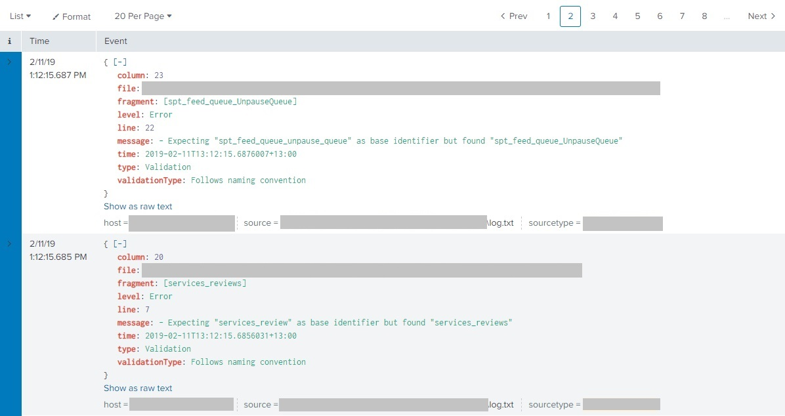

# Database tool #
Project that uses Microsoft.SqlServer.TransactSql.ScriptDom to create an in memory model of databases. 

Potential uses are
- DB testing framework (and adherence to SQL coding standards) results can be added to log aggregators etc
- linters/plug ins for VS, VS code and SSMS
- generate strongly typed metadata to support ORM like Dapper and remove magic strings

